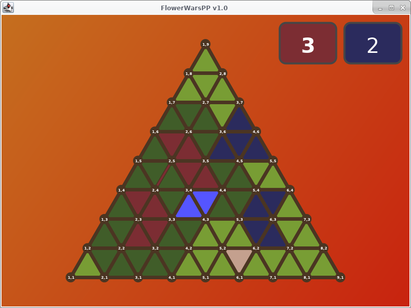

# Intro
Die Gebrüder Gartenpfleger Torsten und Torben streiten sich um Tamara und möchten sie durch das Herrichten einer hübschen Gartenlandschaft
beeindrucken. Leider müssen sich die beiden die Wiese hierfür teilen. Wer schafft es die meisten Gärten zu bepflanzen und diese zu
verzieren indem sie durch Gräben miteinander verbunden werden?

# FlowerWars
- [Spielregeln](specification/rules.md)
- [JavaDoc Dokumentation](documentation) (Am besten lokal öffnen, GitLab zeigt nur den Quellcode der Dokumentation an...)
- [Hilfestellungen zur Implementierung](specification/implementation-tips.md)
- [Computerspieler Strategie](specification/simple-strategy.md)
- [Verwendung der automatischen Tests](specification/test-usage.md)
- [Verwendung der Spielbrettanzeige](specification/display-usage.md)
- [Diverses...](stuff.md)



# Kompilieren und Starten
Das Projekt basiert auf dem Build-System **Maven**. Folgendermaßen kann ein ausführbares jar-Archiv erzeugt werden:
```
mvn compile assembly:single
```
Dieses erzeugte Jar-Archiv kann wie folgt gestartet werden:
```
java -jar target/NAME_OF_THE_JAR_FILE.jar -size <BOARD_SIZE>
```

Mit **Ant** können jar-Archive für das automatisierte Testen und eine einfache Spielbrettanzeigeklasse erzeugt werden:
```
ant update
ant
```

# Herkunft
FlowerWarsPP ist eine Variation des Spiels [Ponte del Diavolo](https://www.brettspielnetz.de/spielregeln/ponte+del+diavolo.php).
