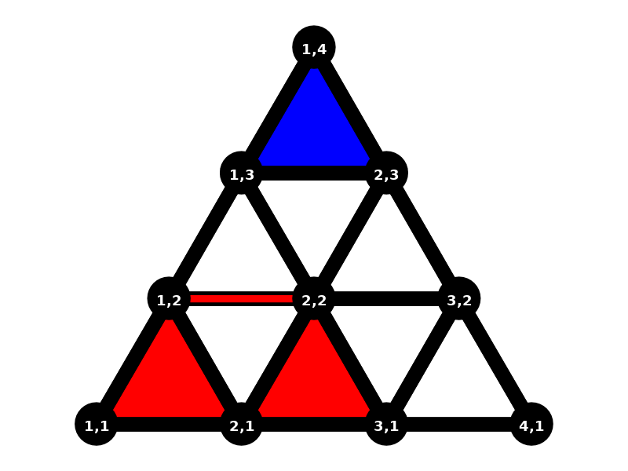
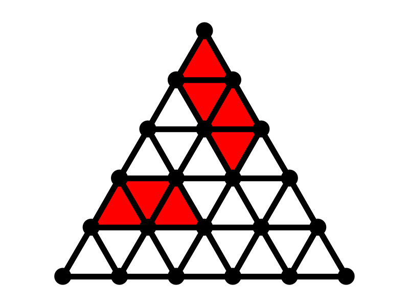
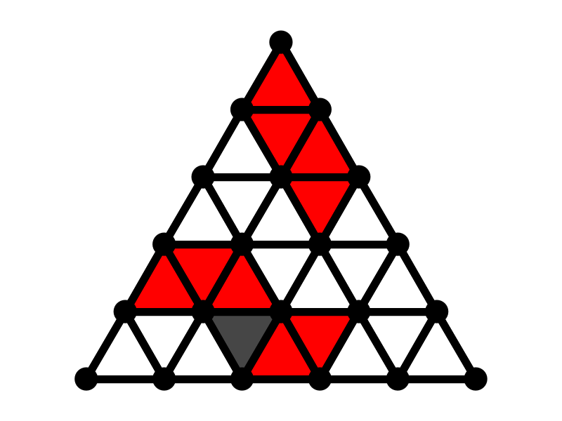

# FlowerWarsPP
FlowerWarsPP ist eine Variation des Spiels [Ponte del Diavolo](https://www.brettspielnetz.de/spielregeln/ponte+del+diavolo.php).

# Motivation
Die Gebrüder Gartenpfleger Torsten und Torben streiten sich um Tamara und möchten sie durch das Herrichten einer hübschen Gartenlandschaft
beeindrucken. Leider müssen sich die beiden die Wiese hierfür teilen. Wer schafft es die meisten Gärten zu bepflanzen und diese zu
verzieren indem sie durch Gräben miteinander verbunden werden?

# Das Spiel
FlowerWarsPP ist ein Spiel für zwei Spieler, die mit den Farben **Rot** und **Blau** spielen. Das Ziel beider Spieler ist es 
eine Wiese so weit wie möglich mit Gärten zu bepflanzen.

# Das Spielbrett
Gespielt wird auf einem dreieckigen Spielbrett mit einer Seitenlänge `3 <= n <= 30`.
Die Gitterpunkte, im Folgenden **Punkte** genannt, werden mit Spalten- und Zeilenkoordinaten versehen, wobei unten links die 
Koordinate `1,1` liegt. 

### Beispiel

> Hier ist ein Spielbrett der Größe `n = 3` dargestellt.


Das Spielfeld stellt eine dreieckige Wiese dar, die wiederum in kleine dreieckige Teilflächen aufgeteilt ist.

Die von drei Punkten eingeschlossenen Flächen werden können mit **Blumen** bepflanzt werden. Auf der Kante von 
einem Punkt zu einem direkten Nachbarn kann ein Wassergraben, kurz 
**Graben**, gebaut werden. Ein Punkt hat hierbei stets maximal `6` direkte Nachbarn. Blumen und Gräben sind die 
Hauptbestandteile von FlowerWarsPP.

### Beispiel


> Auf diesem Spielbrett ist folgende Situation gezeigt:
>- Der rote Spieler hat Blumen auf (`1,1`, `2,1`, `1,2`) und (`2,1`, `3,1`, `2,2`)
>- Der blaue Spieler hat eine Blume auf (`1,3`, `2,3`, `1,4`)
>- Der rote Spieler hat einen Graben von `1,2` nach `2,2`, mit der seine beiden Blumen verbunden werden

# Zugregeln
- Es wird immer abwechselnd gezogen, Rot hat den ersten Zug.
- In einem Zug muss der Spieler sich entscheiden ob er **zwei** Blumen pflanzen *oder* **einen** Graben bauen möchte.
    - Die beiden Blumen können beliebig auf dem Spielbrett positioniert werden, müssen jedoch
    auf leeren Feldern unter Einhaltung der nachfolgenden Regeln für Blumenbeete, Gärten und Gräben
    gebaut werden.
    - Gräben müssen immer zwei eigene Blumen verbinden, genauer zwei Eckpunkte von Feldern, in denen eigene Blumen gepflanzt sind.
- Darüber hinaus kann ein Spieler zu einem beliebigen Zeitpunkt aufgeben, der andere Spieler gewinnt dann das Spiel.
    
## Gärten
- Eine Ansammlung von `4` gleichfarbigen Blumen, die sich an den Seiten berühren, nennt man
einen **Garten**. Ein Garten besteht immer aus exakt `4` Blumen.
- Eine Ansammlung von `1`, `2` oder `3` Blumen nennt man ein **Blumenbeet**. Ein Blumenbeet
kann nie `5` Blumen oder mehr umfassen.
- Ein Garten darf weder mit einem anderen eigenen Garten noch mit einem anderen eigenen Blumenbeet
gemeinsame Eckpunkte haben. Das heißt in anderen Worten, dass Gärten eigene Gärten oder Blumenbeete nicht 
über eine gleiche Seite berühren dürfen (weil dadurch automatisch die Gartengröße überschritten würde) und
auch nicht über einen gemeinsamen Eckpunkt.
- Blumenbeete dürfen sich über Eckpunkte berühren.
- Blumenbeete dürfen nur dann zu einem Garten ausgebaut werden, wenn ...
    - ... sie dann nicht mehr als `4` Blumen enthalten.
    - ... sie dann keine weiteren eigenen Gärten oder Blumenbeete berühren.
- Diese Abstandsregeln gelten nicht für Blumenbeete und Gärten unterschiedlicher Farbe. Blumenbeete und Gärten
unterschiedlicher Farbe dürfen beliebig nebeneinander liegen oder sich über Eckpunkte berühren.

### Beispiele

> Das ist die Ausgangsbasis für die folgenden Beispiele. Es ist ein roter Garten (oben) und ein rotes Blumenbeet der
Größe `3` (unten) zu sehen.


> Das Blumenbeet darf auf diesem Feld nicht zu einem Garten ausgebaut werden, da sonst die Gartenabstandsregel verletzt wäre.


> Durch Pflanzen einer Blume auf genau einem der drei grünen Felder kann das Blumenbeet zu einem Garten aufgewertet werden.


> Durch Pflanzen einer Blume auf einem der grünen Felder wird ein neues Blumenbeet gepflanzt, welches das vorhandene über
Ecke berührt.


> Durch das Pflanzen dieser Blume würde ein Garten der Größe `6` entstehen und damit die Maximalgröße überschreiten.


> Blumen unterschiedlicher Farbe dürfen sich beliebig über Seite oder Ecke berühren.


> Zusammenfassend sind hier alle Felder dargestellt, die durch den Garten nicht mehr bepflanzt werden dürfen.

## Gräben
- Ein Graben verbindet zwei Blumen über dessen Eckpunkte. Diese Verbindung darf maximal einen Schritt
entlang der Gitternetzlinien des Spielfeldes lang sein.
- Ein *Punkt* kann nur ein Grabenende tragen und ist somit für zukünftige Gräben blockiert.
- Die beiden Felder, die sich mit dem Graben eine gemeinsame Seite teilen, müssen beim Bau
des Grabens leer sein. Dieselben Felder gelten nach Bau des Grabens als unfruchtbar und dürfen
von keinen Blumen, unabhängig von der Farbe, bepflanzt werden. Auf den Bau von Gräben haben
unfruchtbare *Felder* keinen Einfluss.

### Beispiele

> Das sind die einzigen drei gültigen Gräben, die zwischen den beiden roten Blumenbeeten gebaut werden können. Es ist nicht
möglich alle dieser drei Gräben zusammen zu bauen!


> Es ist **nicht** möglich eine blaue Blume direkt neben einen Graben anzupflanzen.


> Durch den Graben sind die beiden markierten Felder unfruchtbar und können nicht mehr bebaut werden.


> Es ist nicht möglich beide rote Gräben zeitgleich zu bauen, da sich beide Gräben einen Gitterpunkt teilen.


> Es ist durchaus erlaubt zwei Blumenbeete mehrfach durch Gräben zu verbinden.


> Gräben dürfen auch am Spielfeldrand gebaut werden.

# Spielende
- Kann ein Spieler keinen Zug mehr machen, endet das Spiel sofort.
- Kann ein Spieler keine 2 Blumen mehr anpflanzen und verzichtet auf das Bauen eines Grabens, kann er das Spiel beenden.
- Nach Zugende werden für beide Spieler die Punkte nach diesen Regeln ermittelt:
    - Ein einzelner Garten, der nicht über einen Graben mit anderen Gärten verbunden ist,
    zählt `p(1) = 1` Punkt.
    - Miteinander verbundene Gärten (auch über Blumenbeete hinweg) geben `p(n)` Punkte, wobei `n`
    die Anzahl der verbundenen Gärten beschreibt: `p(n) = p(n-1) + n`
    
- Bei Punktegleichstand endet das Spiel unentschieden.

### Beispiel

> Auf diesem Spielbrett hat der rote Spieler `3` Gärten. Der obere ist isoliert und gibt deshalb `1` Punkt. Die unteren
beiden Gärten sind über das Blumenbeet der Größe `1` miteinander verbunden und geben deshalb `p(2) = 3` Punkte. Insgesamt
hat der rote Spieler damit `4` Punkte.

# ASCII board design
```
                   /\
                  /  \
                 /    \
                /  ++  \
               /  ++++  \
              /__________\
             /\          /\
            /  \  ++++  /  \
           /    \  ++  /    \
          /  **  \    /      \
         /  ****  \  /        \
        /__________\/__________\
       /\          /+          /\
      /  \  ****  /  +        /  \
     /    \  **  /    +      /    \
    /  **  \    /      +    /  ++  \
   /  ****  \  /        +  /  ++++  \
  /__________\/__________+/__________\
```

# Kompilieren und Starten
Das Projekt basiert auf dem Build-System **Maven**. Folgendermaßen kann ein ausführbares jar-Archiv erzeugt werden:
```
mvn compile assembly:single
```
Dieses erzeugte Jar-Archiv kann wie folgt gestartet werden:
```
java -jar target/NAME_OF_THE_JAR_FILE.jar -size <BOARD_SIZE>
```