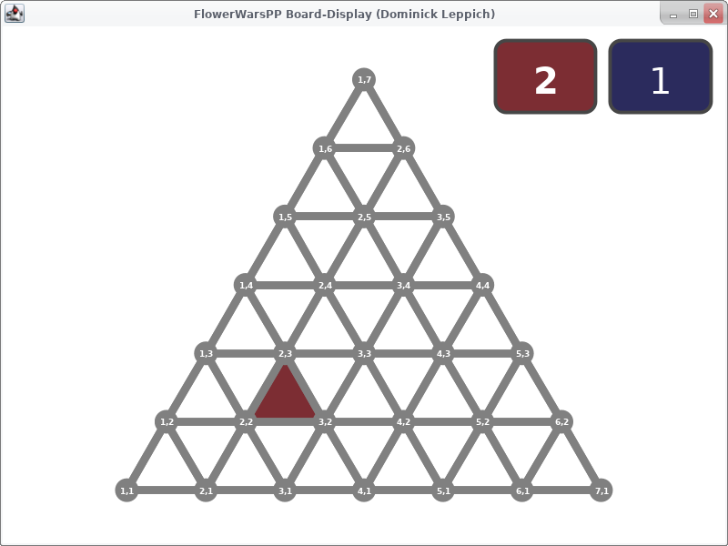

# Verwendung der Spielbrettanzeige
Um das Spielbrett recht früh testen zu können, wird eine einfache Visualisierung mitgeliefert. Sie befindet sich im Archiv
[`FlowerWarsPP-Display.jar`](../FlowerWarsPP-Display.jar).

Die Verwendung ähnelt der bereits bekannten Visualisierung des Rot-Schwarz-Baumes...

Im Archiv gibt es eine Klasse `flowerwarspp.boarddisplay.BoardDisplay`, die ein beliebiges Spielbrett über die [`flowerwarspp.preset.Viewer`](../src/flowerwarspp/preset/Viewer.java) 
Schnittstelle anzeigen kann.

Die Klasse `BoardDisplay` hat einen Standardkonstruktor ohne Argumente und wird ganz einfach mit `new BoardDisplay()` instanziiert.
 Darüber hinaus bietet sie folgende öffentliche Methoden an:
- `setViewer(Viewer)`
Diese Funktion wird verwendet, um dem BoardDisplay das anzuzeigende Spielbrett mitzuteilen.
- `reset()` Setzt die Spezialanzeige zurück (hebt keine Züge mehr hervor, zeigt keinen Status an).
- `update(Move)` Informiert die Anzeige über einen gemachten Zug. Diese Methode muss nach jedem ausführen eines Zuges
aufgerufen werden. Die Anzeige wird dann aktualsieirt und der ausgeführte Zug wird hervorgehoben.
- `showStatus(Status)` Über diese Methode kann der Status des Spielbretts angezeigt werden. Diese Methode kann nach jedem
Zug aufgerufen werden, um den aktuellen Status anzuzeigen. Ist der Status `Ok`, passiert jedoch nichts.
- `close()` Schließt das Fenster und beendet die grafische Anzeige.

# Vorschau
So in etwa sieht die Spielbrettanzeige aus:


### Beispiel
Es soll kurz an der [Beispielimplementation](../example-implementation) gezeigt werden, wie diese Klasse verwendet werden
kann, um ein einfaches Spielbrett anzuzeigen:

```
package flowerwarspp;

import flowerwarspp.preset.*;
import flowerwarspp.boarddisplay.*;

public class Main {
	public static void main(String[] args) {
		Board board = new MyBoard(6);
		Viewer viewer = board.viewer();
		BoardDisplay boardDisplay = new BoardDisplay();
		boardDisplay.setViewer(viewer);

		Move move = new Move(MoveType.Surrender);
		board.make(move);
		boardDisplay.update(move);
		boardDisplay.showStatus(viewer.getStatus());
	}
}
```
