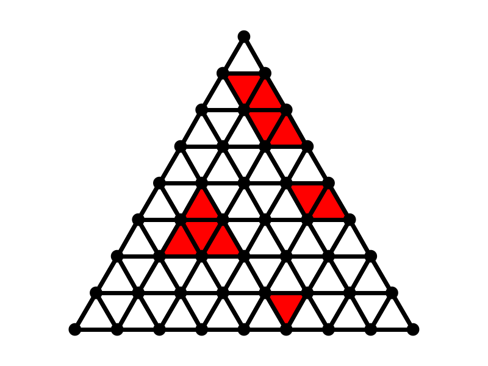
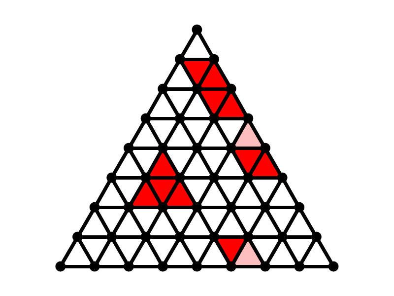
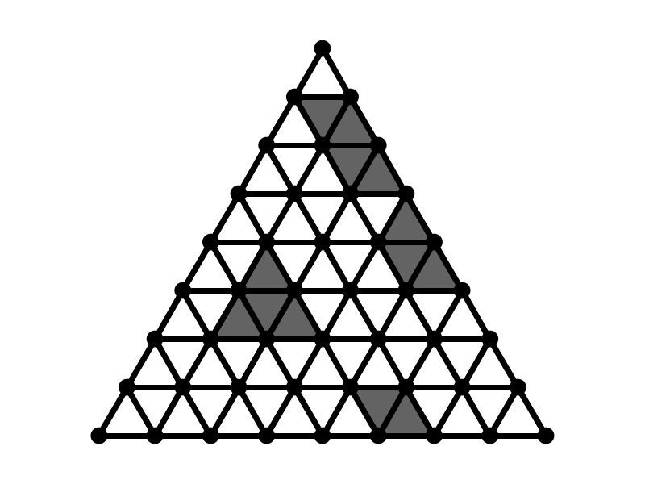
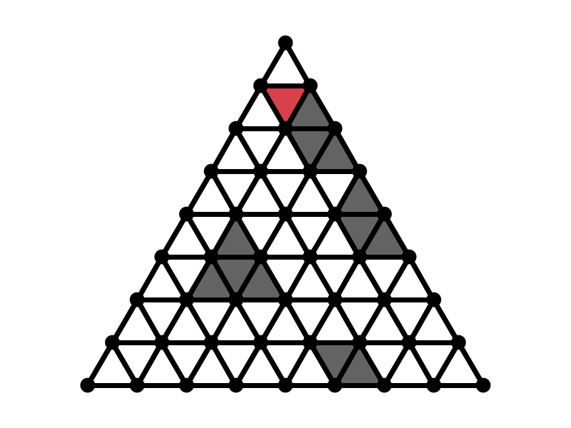
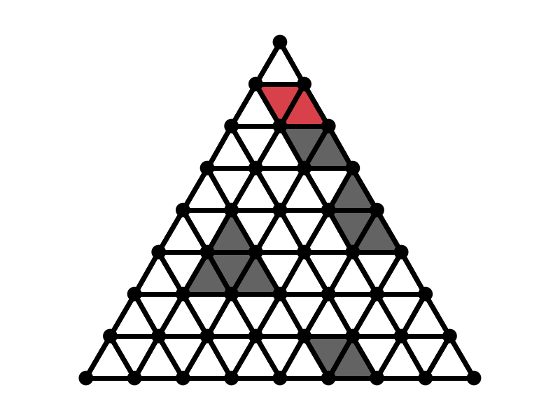
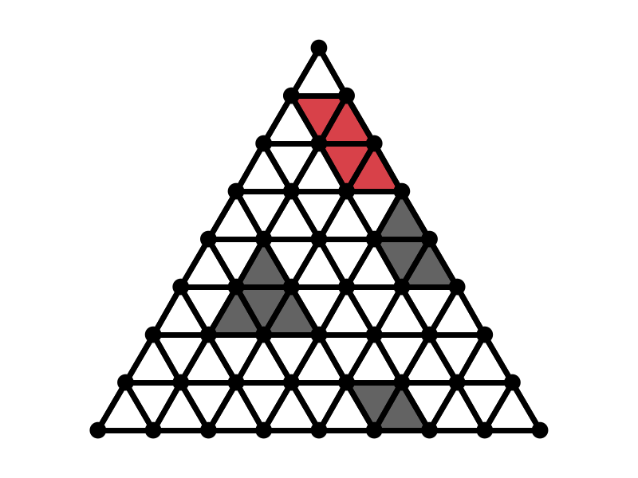
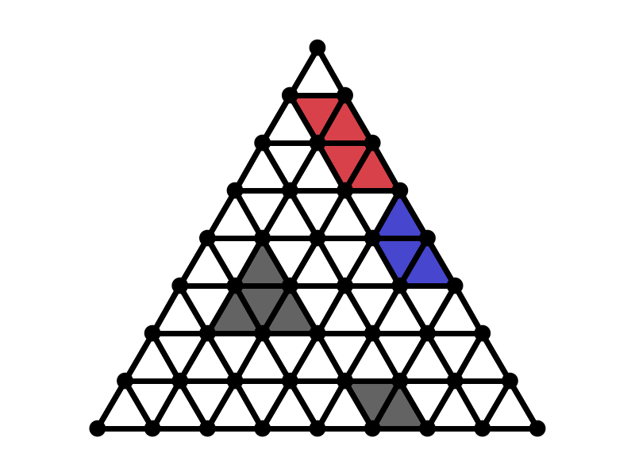
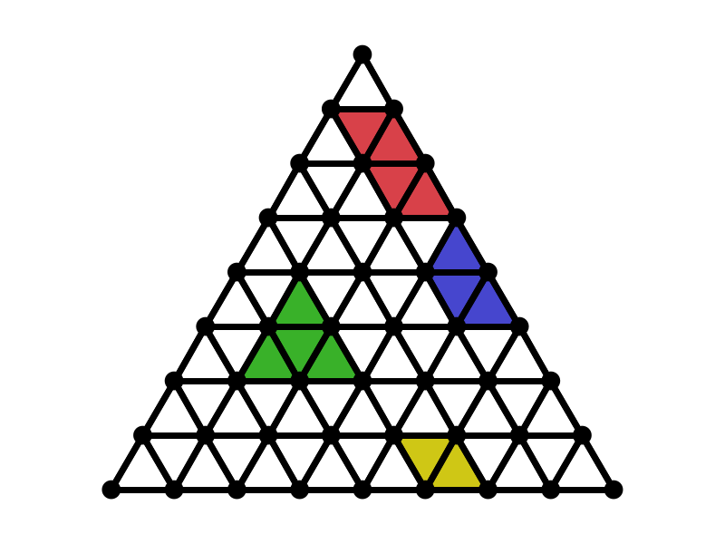
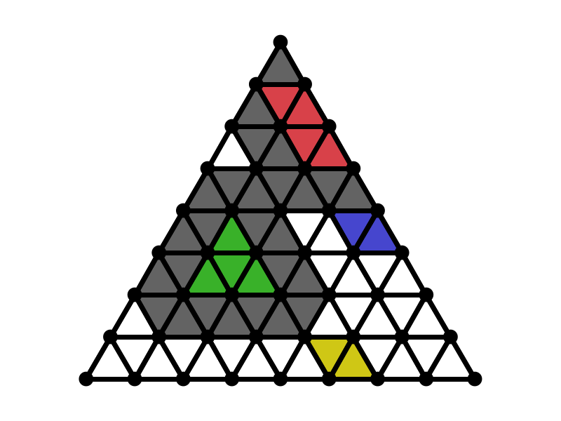

# Die Preset-Datenklassen
Bei dem Entwurf der Datenklassen aus dem `preset` Package wurden einige Entscheidungen getroffen, die die Arbeit mit diesen
stark vereinfachen kann. Es geht genauer um die Klassen `Position`, `Ditch`, `Flower` und `Move`. Für jede dieser Klassen gilt:

- Jede Klasse ist **immutable**. Das heißt, dass sich der Zustand von Instanzen dieser Klasse nach dem
Erzeugen nicht mehr ändern lässt. Das hat zum Beispiel zur Folge, dass Datenstrukturen wie zum Beispiel Listen, welche 
wiederum Preset-Objekte enthalten einfach dupliziert werden können, ohne dass auch von den darin enthaltenen Objekten
echte Kopien erzeugt werden müssen.
- Jede Klasse überschreibt die Methode `hashCode()` und liefert für gültige Instanzen eindeutige Werte zurück. Mit gültig
ist hierbei gemeint, dass zum Beispiel nur Gräben der Länge `1` betrachtet werden.
- Jede Klasse implementiert das Interface `Comparable` und definiert dadurch eine totale Ordnung auf den Instanzen. Das
kann zum Beispiel verwendet werden, um Listen von Positionen oder gültigen Zügen einfach sortieren zu können.
- Jede Klasse überschreibt die Methode `equals(Object)`, sodass damit zwei Objekte korrekt auf Gleichheit geprüft werden
können.
- Jede Klasse überschreibt die Methode `toString()` und liefert eine menschenlesbare Textrepräsentation des Objektes. 
- Jede Klasse stellt eine statische Methode `parseXYZ(String)` zur Verfügung, mit der Text in eine Instanz dieser Klasse
umgewandelt werden kann. Der übergebene String muss hierbei die gleiche Syntax haben, die auch von `toString()`
zurückgegeben wird.

# Das Spielbrett 
## Interne Repräsentation
Für die interne Repräsentation sind gewöhnliche Arrays nicht die beste Wahl, da die Spiellogik sonst sehr mühselig werden
kann.

Da alle Datenklassen aus dem Package `preset` einen eindeutigen Hashwert haben, bieten sich zum Speichern von Blumen auf
dem Spielbrett Datenstrukturen an, die sich das zu Nutze machen. Ein Bespiel hierfür ist zum Beispiel die Klasse `HashSet`.

## Erkennen von gültigen Zügen
Mit der folgenden Strategie kann einfach überprüft, ob ein Zug die Gartenregeln verletzt oder nicht. Diese Strategie ist
jedoch nicht ausreichend um alle möglichen gültigen Züge zu erkennen, die Gräbenzüge sind hier nicht berücksichtigt!

Um diese Strategie umsetzen zu können ist es erforderlich, dass Felder auf dem Spielbrett gefärbt werden können. Weiterhin
müssen jedem Feld seine maximal drei direkten Nachbarn (über eine gemeinsame Seite) bekannt sein. Für diese Strategie sind
nur die eigenen Blumenbeete von Interesse, die anderen können ignoriert werden und werden in diesem Beispiel ausgeblendet:

1. Setze die beiden Blumen des Zuges, der getestet werden soll, auf dem Spielfeld
2. Färbe alle Blumen (aus allen Blumenbeeten) der eigenen Farbe `grau`.
3. Färbe ein beliebiges `graues` Feld mit einer Farbe, die bisher nicht verwendet wurde.
4. Färbe alle direkten Nachbarn dieses ausgewählten Feldes mit der gleichen Farbe wie in 3.
5. Wiederhole Schritt 4 rekursiv für alle gefärbten Felder solange, bis keine **direkten**, `grauen` Nachbarn über eine gemeinsame Seite mehr vorhanden sind.
6. Gehe zurück zu Schritt 3, falls noch `graue` Felder auf dem Spielbrett vorhanden sind. Ansonsten gehe weiter zu Schritt 7.
7. Jetzt sind alle Felder gefärbt. Bestimme für alle gleichgefärbten Felder die Anzahl der Felder dieser Farbe und speichere
diese Zahl in jedem dieser Felder.
8. Ob der Zug gültig war kann jetzt so geprüft werden:
- Hat ein beliebiges gefärbtes Feld einen Wert der größer ist als `4`, ist der Zug ungültig. Durch diesen Zug ist ein 
übergroßer Garten entstanden!
- Prüfe für alle gefärbten Flächen der Größe `4` die Gartenabstandsregel. Das heißt, alle Nachbarfelder (ganz gleich ob 
über eine gemeinsame Seite oder über Ecke) müssen leer sein. Ist das nicht der Fall, ist der Zug ungültig!
- Ist keine der beiden zuvor genannten Bedingungen verletzt, war dies ein gültiger Zug.

### Hinweis
Die hier verwendeten Farben dienen nur der besseren Anschauung und haben keine Verbindung zu den Spielerfarben und deren
gesetzten Blumen oder Gräben. Bei der Implementierung dieser Strategie sollten keinesfalls Farben zur Unterscheidung der
zusammenhängenden Blumen verwendet werden, sondern eher einer Markierung durch beispielsweise fortlaufende Zahlen!

### Beispiel
Diese Strategie soll an einem kurzen Beispiel illustriert werden...

> Das ist die Ausgangssituation auf dem Spielbrett.

> Schritt 1: Die beiden leicht rot markierten Felder des Zuges der zu testen ist werden auf dem Spielfeld gesetzt.

> Schritt 2: Alle roten Felder (inklusive der neu gesetzten) werden grau gefärbt.

> Schritt 3: Ein zufällig ausgewähltes `graues` Feld wird `rot` gefärbt.

> Schritt 4: Die direkten Nachbarn dieses `roten` Feldes werden nun auch `rot` gefärbt.

> Schritt 5: Färbe rekursiv alle Nachbarn des `roten` Feldes auch `rot`, bis alle erreichbaren Felder `rot` sind.

> Schritt 6: Beginne nun ein neues graues Feld zu färben. Wähle hierfür eine andere Farbe, zum Beispiel `blau`. Färbe
rekursiv alle Nachbarn.

> Schritt 6': Färbe alle noch übrigen grauen Felder ebenfalls auf die gleiche Weise.

> Schritt 7: Alle Felder sind nun `rot`, `blau`, `grün` und `gelb` gefärbt. Die `roten` und `grünen` Felder werden mit `4`
beschriftet, die `blauen` mit `3` und die `gelben` mit einer `2`. Da keine Zahlen größer als `4` sind, ist die Maximalgröße eines Gartens
nicht überschritten. Jetzt muss für jeden Garten noch die Abstandsregel geprüft werden. Hierzu sind die ungültigen an Gärten
angrenzenden Felder `grau` markiert worden. Jetzt ist erkennbar, dass eine der `blau` markierten Blumen in einem der
ungültigen Felder liegt. Der Zug ist somit ungültig!
